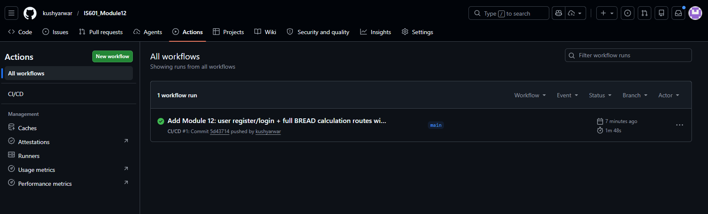
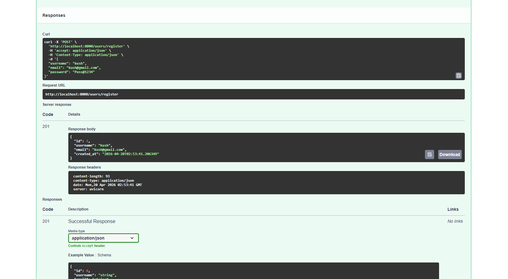
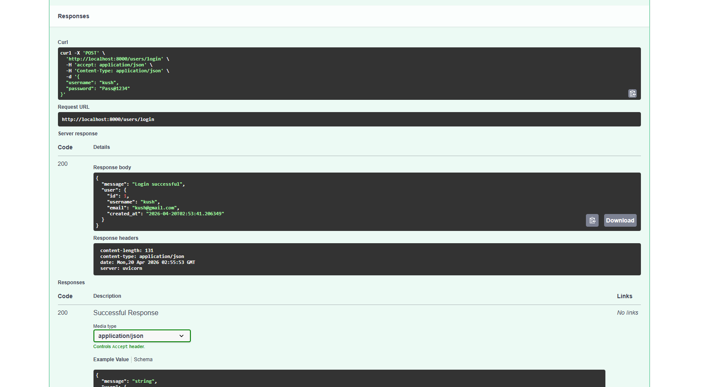
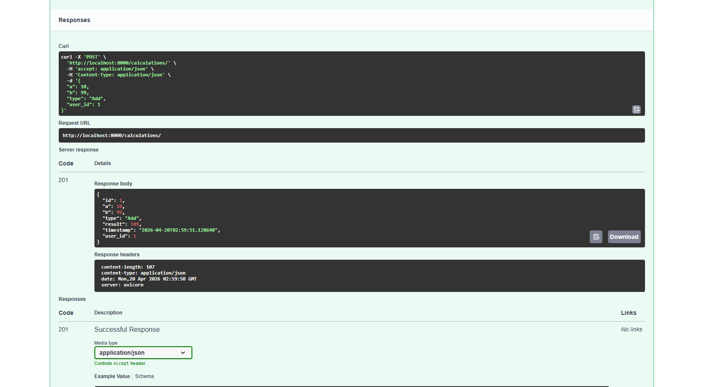

# IS601 Module 12 – User & Calculation Routes + Integration Testing

FastAPI back-end with user registration/login and full BREAD calculation endpoints, backed by PostgreSQL and tested with pytest.

## Docker Hub

**Image:** `kushyarwar/is601-module12:latest`

Pull and run:

```bash
docker pull kushyarwar/is601-module12:latest
docker run -p 8000:8000 -e DATABASE_URL=<your-postgres-url> kushyarwar/is601-module12:latest
```

---

## Screenshots

### GitHub Actions – CI/CD Pipeline Passing



### User Registration (POST /users/register)



### User Login (POST /users/login)



### Add Calculation (POST /calculations/)



---

## Running the Application Locally (Docker Compose)

```bash
docker-compose up --build
```

- API: http://localhost:8000
- Swagger UI: http://localhost:8000/docs
- ReDoc: http://localhost:8000/redoc
- pgAdmin: http://localhost:5050 (admin@admin.com / admin)

---

## Running Integration Tests Locally

Tests use **SQLite** locally (no Postgres required).

```bash
# Install dependencies
pip install -r requirements.txt

# Run all tests with coverage
pytest tests/ -v --cov=app --cov-report=term-missing
```

---

## API Endpoints

### User Routes

| Method | Path | Description |
|--------|------|-------------|
| POST | `/users/register` | Register a new user (hashed password) |
| POST | `/users/login` | Login with username + password |
| GET | `/users/` | List all users |
| GET | `/users/{id}` | Get user by ID |
| DELETE | `/users/{id}` | Delete user (cascades calculations) |

### Calculation Routes (BREAD)

| Method | Path | Description |
|--------|------|-------------|
| GET | `/calculations/` | Browse all calculations |
| GET | `/calculations/{id}` | Read a single calculation |
| PUT | `/calculations/{id}` | Edit a calculation (recomputes result) |
| POST | `/calculations/` | Add a new calculation |
| DELETE | `/calculations/{id}` | Delete a calculation |
| GET | `/calculations/join/all` | Calculations joined with username |

Supported operation types: `Add`, `Sub`, `Multiply`, `Divide`

### Other

| Method | Path | Description |
|--------|------|-------------|
| GET | `/health` | Health check |

---

## CI/CD Pipeline

GitHub Actions (`.github/workflows/ci.yml`):

1. **Test job** – Spins up PostgreSQL 15, installs dependencies, runs `pytest` against a real Postgres DB.
2. **Build & push job** – On successful merge to `main`, builds the Docker image and pushes to Docker Hub as `kushyarwar/is601-module12:latest`.
3. **Security scan** – Runs Trivy vulnerability scan on the pushed image.

Required GitHub Secrets: `DOCKERHUB_USERNAME`, `DOCKERHUB_TOKEN`

---

## Manual Testing via OpenAPI

1. Start the app: `docker-compose up --build`
2. Open http://localhost:8000/docs
3. Register a user via `POST /users/register`
4. Login via `POST /users/login`
5. Create calculations via `POST /calculations/` using the returned `user_id`
6. Browse, read, edit, and delete calculations using the BREAD endpoints
